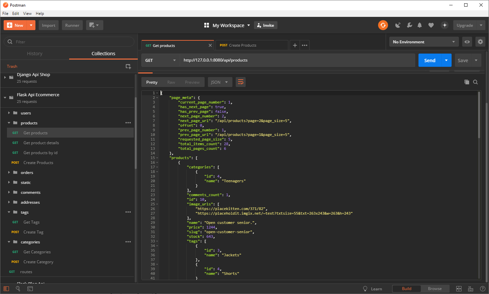
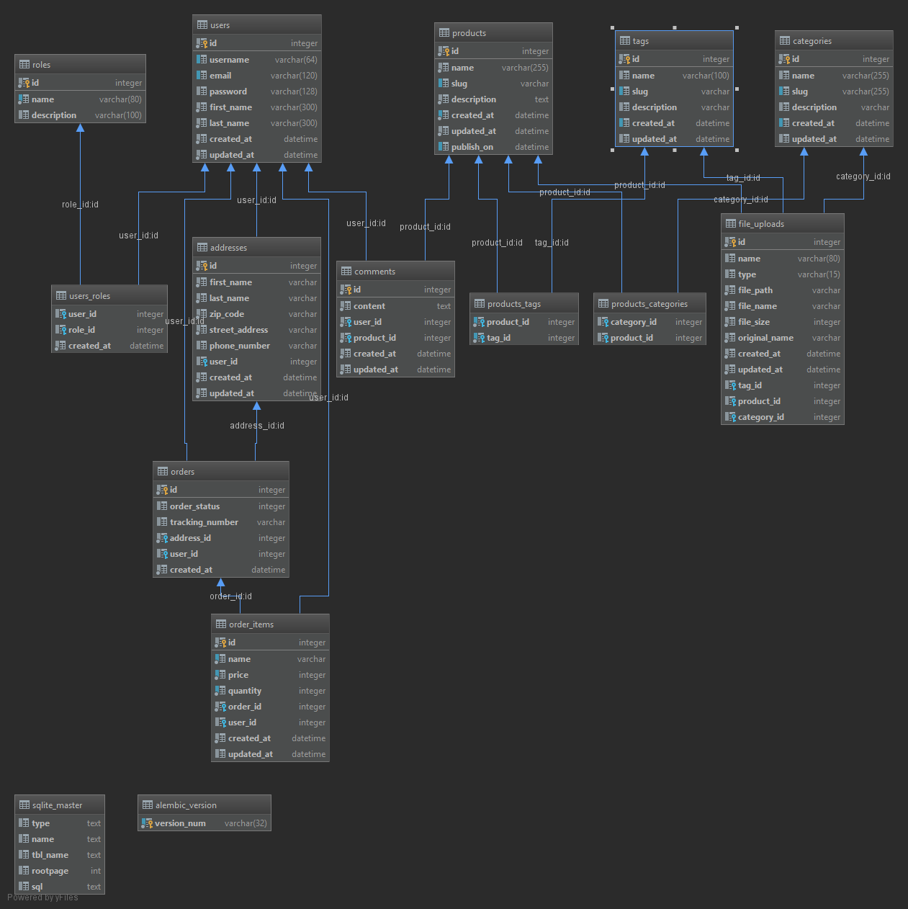

# Introduction
This is one of my E-commerce API app implementations. It is written in Python with Flask as the main dependency.
This is not a finished project by any means, but it has a valid enough shape to be git cloned and studied if you are interested in this topic.
If you are interested in this project take a look at my other server API implementations I have made with:

- [Node Js + Sequelize](https://github.com/melardev/ApiEcomSequelizeExpress)
- [Node Js + Bookshelf](https://github.com/melardev/ApiEcomBookshelfExpress)
- [Node Js + Mongoose](https://github.com/melardev/ApiEcomMongooseExpress)
- [Python Django](https://github.com/melardev/DjangoRestShopApy)
- [Java EE Spring Boot and Hibernate](https://github.com/melardev/SBootApiEcomMVCHibernate)
- [Ruby on Rails](https://github.com/melardev/RailsApiEcommerce)
- [AspNet Core](https://github.com/melardev/ApiAspCoreEcommerce)
- [Laravel](https://github.com/melardev/ApiEcommerceLaravel)

The next projects to come will be:
- Elixir with phoenix and Ecto
- AspNet MVC 6
- Java EE with Jax RS with jersey
- Java EE with Apache Struts 2
- Spring Boot with Kotlin
- Go with Gorilla and Gorm
- Go with Beego
- Laravel with Fractal and Api Resources
- Flask with other Rest Api frameworks such as apisec, flask restful

## WARNING
If you debug the seed_database.py file then be warned you may run into exceptions related to thread safety, in that
case just rerun the script and try to not place the breakpoint where creating the model takes place
# Getting started
1. Git clone the project
1. Setup Flask-Migrate
`flask db init && flask db migrate && flask db upgrade`
1. Seed the database with
1. Seed the database
`python2 seed_database.py`

While you play with the project, if you want to reset the database(delete the app.db, regenerate the migrations and migrate)
you can execute reset.bat, it relies on flask2 executable(you may want to change it to flask instead); Flask2 it is
just a custom bat file that I have that points to flask.exe from my Python2 Installation folder

# Useful commands
- Setup the migrations folder to hold migration files
`flask2 db init`
- Generate migration files
`flask2 db migrate`
- Make the actual migration and create tables on database
`flask2 db upgrade`

# Features
- Authentication / Authorization
- JWT middleware for authentication
- Multi file upload
- Database seed
- Paging
- CRUD operations on products, comments, tags, categories, orders

- Orders, guest users may place an order

# What you will learn
- Flask
- Jwt authentication with flask
- Controllers
- Middlewares
- JWT Authentication
- Role based authorization
- Flask SQLAlchemy ORM
    - associations: ManyToMany, OneToMany, ManyToOne
    - Select specific columns
    - Eager loading
    - Count related association
    
- seed data
- misc
    - project structure

# Understanding the project
In project apps you will most of the times see that there is the launcher file, and the creation of the app and db is done
elsewhere, why? to avoid circular dependencies. The app flask instance along with the db are heavily import from
all over the places in our project, those variables are better placed in a separate file, I will explain this aspect 
in a youtube video if you did not get it.

# TODO
- Security, validations, fix vulnerabilities
- File upload validation
- unit testing
- Create annotation to require authenticated user to be admin
- Considering changing the project structure to a flask-ish way, with extensions clearly separated in a separate file
even though the way it is implemented right now is not that bad
- I do not think it is a good idea to put the get_dto inside the model itself, that should be placed in the corresponding
serializer class to clearly separate the concerns, this is easy to refactor

# Resources
- [](https://flask-jwt-extended.readthedocs.io/en/latest/api.html#flask_jwt_extended.JWTManager.user_identity_loader